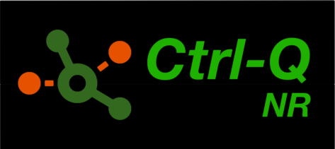

<h1 align="center">Node-RED nodes for interacting with cloud and client-managed Qlik Sense.
</h1>

Ctrl-Q NR is a collection of Node-RED nodes that allow you to interact with Qlik Sense, both the cloud and on-premises (=client-managed) versions.

The nodes are designed to be easy to use and can be used to build powerful data-driven applications and integrations on the low-code Node-RED platform.

## Installation

To use these nodes, you will need to have Node-RED installed. Once you have Node-RED installed, you can install these nodes using the Node-RED palette manager.

1. Open Node-RED
2. Click on the menu icon in the top-right corner
3. Click on "Manage palette"
4. Click on the "Install" tab
5. Search for "ctrl-q-nr"
6. Click "Install"

## Available nodes

Qlik Sense client-managed nodes:

-   **qseow-app**: Used to interact with Qlik Sense apps.
-   **qseow-task**: Used to start Qlik Sense tasks. Reload, external program, distribution, and user sync tasks are supported.
-   **qseow-service-status**: Used to retrieve the status of a Qlik Sense service, such as the Qlik Sense Repository Service (QRS) or the Qlik Sense Engine Service (QES) for all the nodes in the Sense cluster.
-   **qseow-tag**: Used to create, update, or delete Qlik Sense tags.

Qlik Sense Cloud nodes:

-   **qscloud-app**: Used to interact with Qlik Sense Cloud apps, for example reading app metadata or reloading apps.
-   **qscloud-license**: Used to retrieve license information for a Qlik Sense Cloud tenant.
-   **qscloud-reload**: Used to reload a Qlik Sense Cloud app.
-   **qscloud-reload-status**: Used to monitor all reloads in a Qlik Sense Cloud tenant.

## Usage

Once you have installed the nodes, you can use them in your Node-RED flows. The nodes are organized into different categories based on their functionality. To use a node, simply drag it from the palette onto your flow and configure it using the node's properties.

For more information on how to use these nodes, please refer to the [documentation](https://ptarmiganlabs.com/ctrl-q-nr/) and articles at [ptarmiganlabs.com](https://ptarmiganlabs.com).

## Contributing

If you would like to contribute to this project, please follow these steps:

1. Fork this repository
2. Create a new branch for your changes
3. Make your changes and commit them
4. Push your changes to your fork
5. Create a pull request

## License

This project is licensed under the MIT License. See the [LICENSE](LICENSE) file for details.
